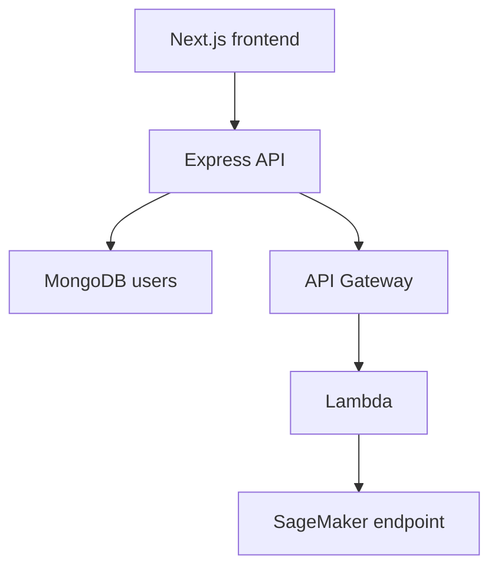

# MedicAI backend — ML inference integration

Course-based Node.js and Express API for an image-classification learning application. **Original application: Patrik Szepesi.** This fork preserves the upstream project and records portfolio changes in pull requests.

## Architecture



The web API accepts a base64 image, sends binary input to a configured inference API and returns the upstream result. SageMaker resources and the Lambda integration are external dependencies; this repository does not provision them.

## Portfolio changes

- Replaced the instructor-specific endpoint with `AWS_INFERENCE_URL`.
- Removed raw image logging from the prediction controller.
- Added bounded image decoding, a 15-second upstream timeout and predictable failure responses.
- Added isolated contract tests and a pull-request workflow that needs no AWS credentials.
- Added explicit configuration and operational guidance.

These are engineering changes to a course project, not evidence of a deployed clinical product or a client production assignment.

## Quick start

Prerequisites: a compatible Node.js runtime, MongoDB and an HTTPS inference API implementing the course contract. The dependency set is inherited and requires modernization before public deployment.

```bash
cp .env.example .env
# Set DATABASE, generate JWT_SECRET and configure your own AWS_INFERENCE_URL.
npm ci
npm start
```

Use the frontend's same-origin `/api` proxy for browser authentication. The API listens on port 8000 by default. Never commit `.env` or credentials.

Tests run independently of legacy application dependencies:

```bash
node --test inference.test.cjs
```

## Operations and limits

| Condition | Response |
|---|---|
| Missing or malformed image | 400 |
| Decoded image above 3 MiB | 413 |
| Missing or unsafe inference URL | 503 |
| Upstream timeout | 504 |
| Upstream failure or missing result | 502 |

The handler preserves the frontend's `{message: result}` success shape. Content validation is limited to base64 decoding and size; real image-signature checks and model-specific preprocessing remain future work. The application-level JSON parser also imposes a 5 MB request limit.

For failures, check API availability, upstream latency, API Gateway integration logs and SageMaker endpoint health. Avoid logging input images, JWTs or database credentials. Roll back application changes using a reviewed release commit; model rollback requires a separately versioned SageMaker deployment.

## Further hardening

Review CSRF middleware placement, restrictive CORS, secure cookie settings, dependency advisories, readiness endpoints, rate limits and observability before external exposure. Add IaC for the cloud integration and a tested teardown path. No cloud deployment has been performed by this repository update.

## Attribution

- [Original backend](https://github.com/patrikszepesi/MedicAIBackEnd)
- [Udemy course](https://www.udemy.com/course/build-and-deploy-a-ml-model-to-production-with-aws-and-react/)
- [Original frontend](https://github.com/patrikszepesi/MedicAIFrontEnd)
- [Original notebook](https://github.com/patrikszepesi/StartingNotebook)

Review upstream ownership and licensing before redistribution beyond the GitHub fork. No new license is assigned to the inherited application.
